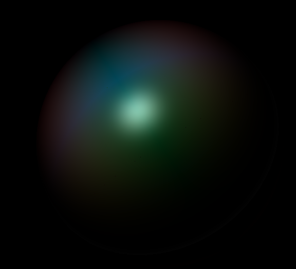

# Mother-of-Pearl-shader

https://harashunnn.github.io/Mother-of-Pearl-shader/

螺鈿の質感をESSL（GLSLの派生規格）を用いてプログラマブルシェーダで実装し、表現した。3D表示にはWebGLのラッパーライブラリであるThree.jsを使用した。反射モデルに関しては双方向反射率分布関数（Bidirectional Reflectance Distribution Function）を使用した。BRDFモデル（螺鈿）の拡散反射成分、並びに鏡面反射成分の近似式は武氏の考案した数式モデル![paper]を使用した。

## 参考文献

![paper]: 武孝.実測値を用いた螺鈿の質感表現.研究報告グラフィクスとCAD(CG).2012,No.14 ,p.1-4.
